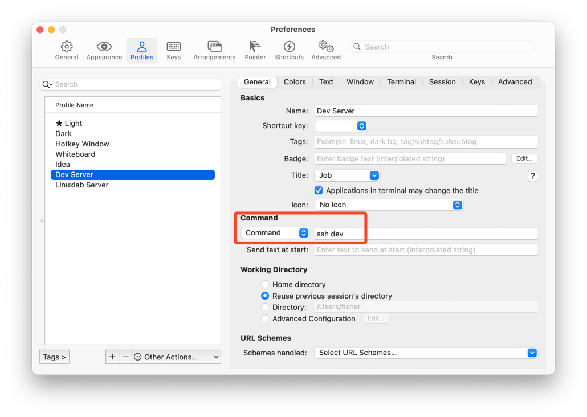
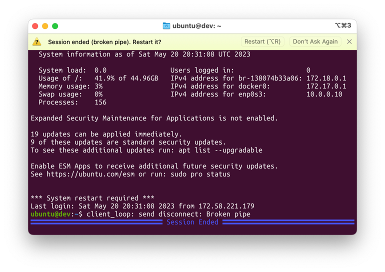

Well, I admit I didn't end up writing as much as I'd hoped.
When final projects and final exams rolled around,
I put everything aside.
Oh well.

Anyway, I recently got an Ubuntu instance on Oracle Cloud Infrastructure
(I know, I know, I'll explain this in a different post).

It's been nice, but Ubuntu really seems to like its TUIs,
and these TUIs don't look very good in my light-themed terminal.

I think they're supposed to look like this:

This second screenshot was taken with the Ubuntu theme.

So, I wanted a way to easily access my instance with the Ubuntu theme,
while keeping my normal terminal light themed.

My solution was to use iTerm2's profiles.
I kept my default profile as light mode,
and created a new profile for my instance, specifying `ssh dev` as the startup command:

This worked, but I was worried that my ssh windows would disappear when my connections close.
Luckily, iTerm2 had a fix for that.

In the "Session" section of the profile settings,
I could change "After a session ends:" to "No action" from its default, "Close".

With this, when my connection closes, the terminal window stays open, and I have the option to restart the session.

